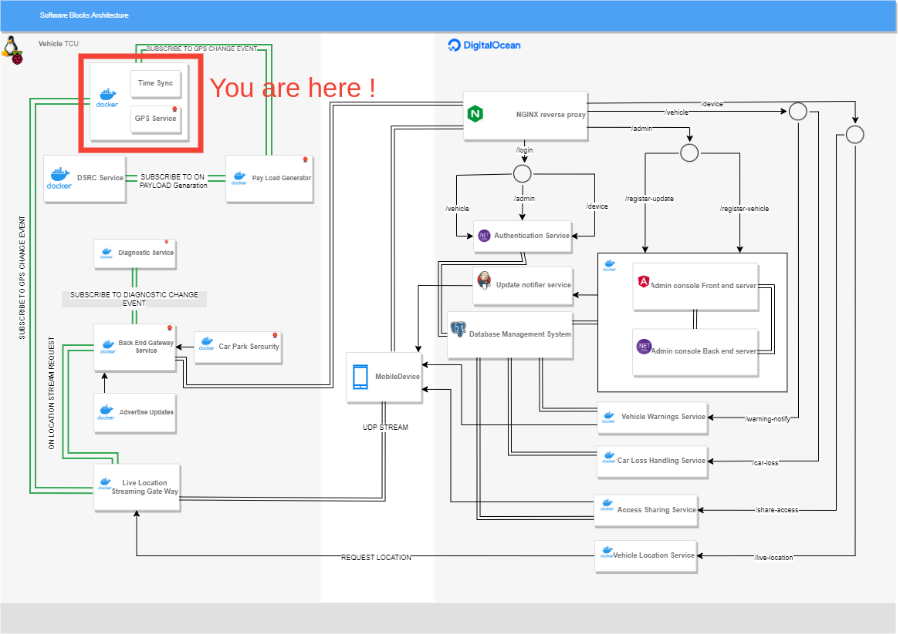

# GPS-serial-transceiver-rpi
GPS serial transceiver for the raspberry pi


# How to run it
```bash
$ docker run --name gps_transceiver --rm --privileged --net host -v /tmp:/tmp:z -v /dev/ttyACM0:/dev/ttyACM0 gps-serial-receiver
```

# bird-view


## check this medium blog:

[How to make serial device node name static](https://inegm.medium.com/persistent-names-for-usb-serial-devices-in-linux-dev-ttyusbx-dev-custom-name-fd49b5db9af1)

